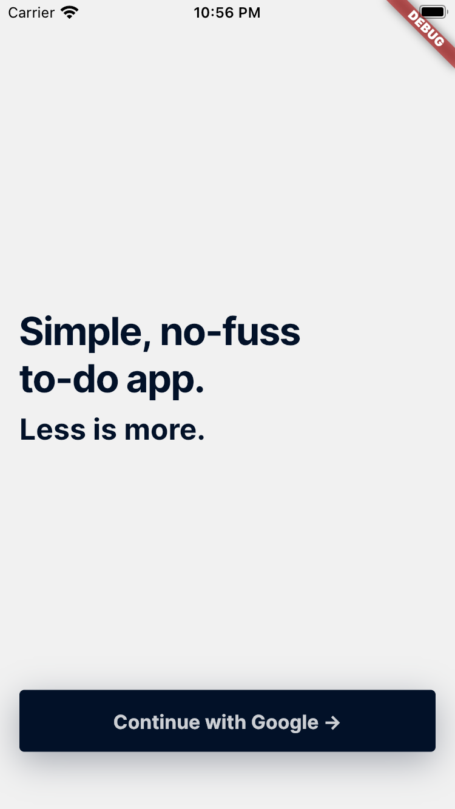

# todo_challenge

A simple todo app in Flutter with a minimalistic design.

 

## Requirements

- Tested on Flutter 2.5.2
- Dart 2.14

## Starting the app

- `flutter pub get`
- `flutter run`

## Platforms supported

- Android
- iOS (tested on simulators only - I don't own an iPhone)
